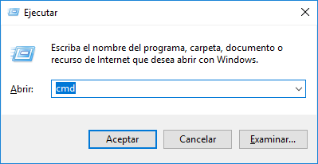
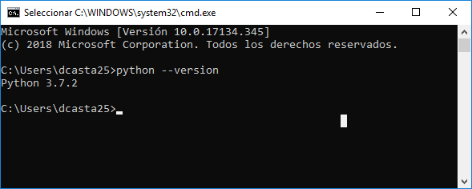
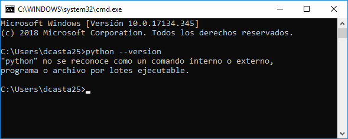
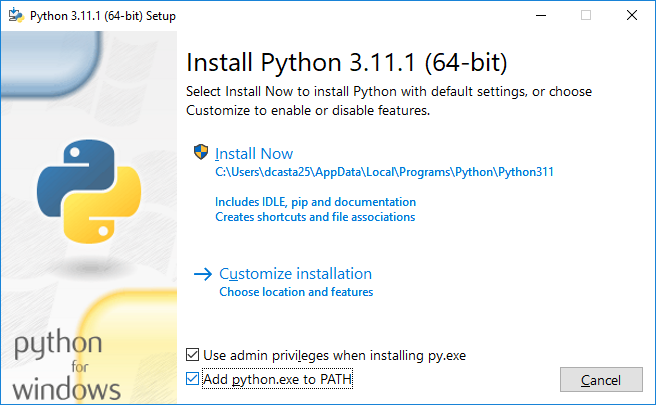
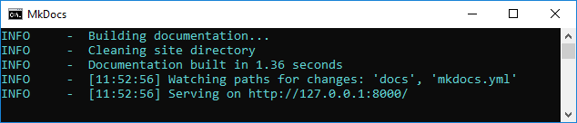

# Instalación de MkDocs

Para usar esta plantilla del informe debemos tener intalado MkDocs. Para lograr esto seguiremos los siguientes pasos:

1. (En Windows) presionar las teclas al tiempo `Win` + `R`, esto abrira la ventana ejecutar donde escribiremos `cmd` y presionamos aceptar: 

	

2. En la ventana verificaremos que tengamos instalado [Python](https://www.python.org/downloads/) escribiendo `python --version`

	

	

	Si _"python" no se reconoce como un comando interno o externo, programa o archivo por lotes ejecutable._ Deberemos instalar [Python](https://www.python.org/downloads/) usando el instalador que descargaremos de [esta página](https://www.python.org/downloads/). En el momento de instalarlo debemos activar la opción **Add python.exe to PATH**.

	

	Una vez terminada la instalación deberemos tener python instalado y escribiendo `python --version` en el terminal (`cmd`) deberemos ver la versión instalada. 

3. Instalaremos los paquetes necesarios para usar MkDocs en nuestro computador en el terminal ingresaremos los siguientes comandos: 

	- `python -m ensurepip`
	- `python -m pip install mkdocs`
	- `python -m pip install pymdown-extensions`

4. Despues de haber instalado todo lo anterior sin errores (si tuvieron errores comunicarse con el profesor). Podemos descomprimir la carpeta de la plantilla y ejecutar el `serve.bat`.

	

	Deberian tener algo similar a lo presentado en la imagen anterior, el sitio para el informe, mientras esta ventana este abierta será accesible por [`http://127.0.0.1:8000/`](http://127.0.0.1:8000/)

Para usar la plantilla del informe con MkDocs, debemos tener instalado en el computador los siguientes programas:

1. Python
2. PIP
3. MkDocs

Para verificar que están instalado podemos usar el archivo `verificar.bat` de la carpeta de la plantilla. En caso de que alguno de ellos presente el siguiente mensaje:

```txt
"_____" no se reconoce como un comando interno o externo,
programa o archivo por lotes ejecutable.
```

Deberemos instalarlo, Si nos faltan varios programas debemos instalarlos en el orden presentado, las instrucciones de instalación para cada uno, están en sus páginas oficiales: 

1. 
2. [PIP](https://packaging.python.org/en/latest/tutorials/installing-packages/#ensure-you-can-run-pip-from-the-command-line)
3. [MkDocs](https://www.mkdocs.org/getting-started/#installation)

Después de la instalación, el archivo `verificar.bat` no debería mostrar el mensaje `..no se reconoce como..`

Ahora teniendo todo instalado podemos usar el archivo `serve.bat` para lanzar el servidor MkDocs y tener el sitio del parcial funcionando. Para acceder al parcial desde el navegador escribiremos:

[`http://127.0.0.1:8000/`](http://127.0.0.1:8000/)

## Editar los archivos de texto

Para editar los archivos de texto recomiendo usar [Visual Studio Code](https://code.visualstudio.com/). Podemos editar los archivos del parcial en cualquier editor de texto usando la sintaxis [markdown](https://www.markdowntutorial.com/es/).
